<div align="center">
</div>

<br/>

<div align="center">
<sub>
<a href="#boot"><code>BOOT</code></a> <a href="#core"><code>CORE</code></a> <a href="#mission"><code>MISSION</code></a> <a href="#status"><code>STATUS</code></a> <a href="#experiments"><code>EXPERIMENTS</code></a> <a href="#projects"><code>PROJECTS</code></a> <a href="#skills"><code>SKILLS</code></a>
<br/>
<a href="#architecture"><code>ARCHITECTURE</code></a> <a href="#knowledge"><code>KNOWLEDGE</code></a> <a href="#research"><code>RESEARCH</code></a> <a href="#analytics"><code>ANALYTICS</code></a> <a href="#terminal"><code>TERMINAL</code></a> <a href="#opensource"><code>OPEN&nbsp;SOURCE</code></a> <a href="#contact"><code>CONTACT</code></a>
</sub>
</div>


<a id="boot"></a>
<div align="center">
</div>
<br/>
<div align="center">
</div>
<br/>
<div align="center">
</div>


<a id="core"></a>
<div align="center">
</div>
<br/>
<div align="center">
</div>
<br/>
<div align="center">
</div>


<a id="mission"></a>
<div align="center">
</div>
<br/>
<div align="center">
</div>

<table width="100%">
<tr>
<td width="50%" valign="top">

```yaml
name:            Abdul Baseer Hammad
callsign:        H.A.M.M.A.D
role:            Backend Developer / AI Engineer
location:        Bangalore, India
primary_lang:    Python
```

</td>
<td width="50%" valign="top">

```yaml
current_role:    AI Automation Intern, IBM SkillsBuild
studying_at:     HKBK College of Engineering (VTU)
build_mode:      solo — design, code, ship independently
system_status:   ONLINE — accepting collaborations
```

</td>
</tr>
</table>

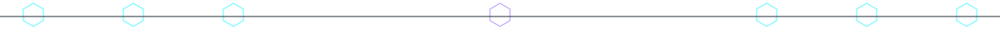

<a id="status"></a>
<div align="center">
</div>
<br/>
<div align="center">
</div>
<br/>
<table width="100%">
<tr>
<td width="50%">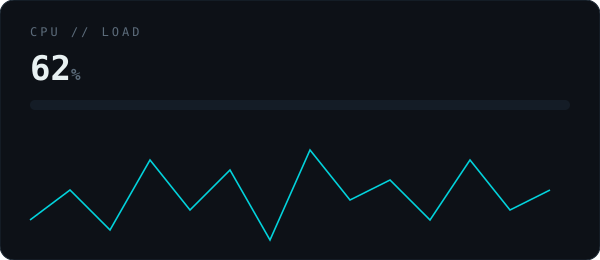</td>
<td width="50%">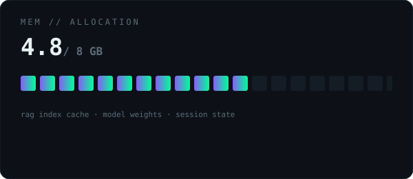</td>
</tr>
</table>

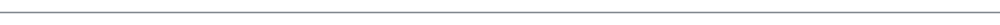

<a id="experiments"></a>
<div align="center">
</div>
<br/>

<table width="100%">
<tr><td>

| Thread | State |
|---|---|
| IBM SkillsBuild capstone (AI Automation & Intelligent Solutions) | in progress |
| HealthX UI — consolidating to a single ChatGPT-style chat + EMR panel | in progress |
| HealthX Lite — scoped on-device Android variant, exploring Gemma-class models | exploratory |

</td></tr>
</table>

<sub>This section stays short on purpose — it's a log of what's actually in flight, not a wishlist.</sub>

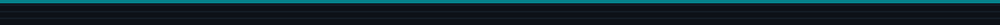

<a id="projects"></a>
<div align="center">
</div>
<br/>
<div align="center">
</div>
<br/>
<div align="center">
</div>
<br/>
<table width="100%">
<tr>
<td width="50%"></td>
<td width="50%"></td>
</tr>
<tr>
<td width="50%"></td>
<td width="50%"></td>
</tr>
</table>
<br/>
<div align="center">
</div>


<a id="skills"></a>
<div align="center">
</div>
<br/>
<div align="center">
</div>

<div align="center">
&nbsp;&nbsp;
&nbsp;&nbsp;
&nbsp;&nbsp;
&nbsp;&nbsp;
&nbsp;&nbsp;

</div>

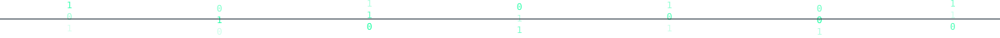

<a id="architecture"></a>
<div align="center">
</div>
<br/>
<div align="center">
</div>
<br/>
<div align="center">
</div>


<a id="knowledge"></a>
<div align="center">
</div>
<br/>
<div align="center">
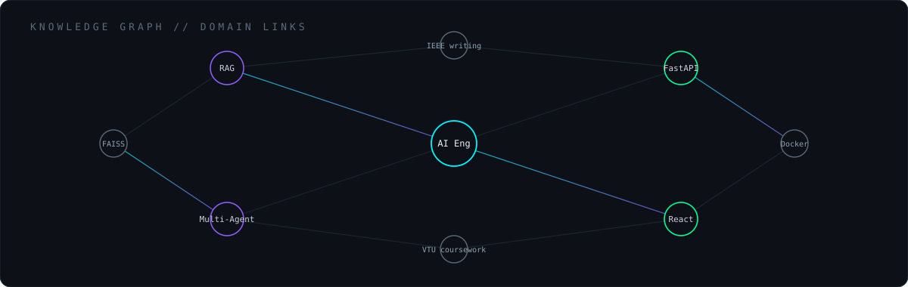
</div>
<br/>
<div align="center">
</div>


<a id="research"></a>
<div align="center">
</div>
<br/>

<table width="100%">
<tr><td>

| Paper / Writeup | Format |
|---|---|
| FaultSeeker++: multi-agent LLM vulnerability localization for DeFi smart contracts | IEEE-format conference paper, LaTeX + TikZ |
| HealthX IEEE submission | in progress on Overleaf |

</td></tr>
</table>

<div align="center">
</div>


<a id="analytics"></a>
<div align="center">
</div>
<br/>
<div align="center">
</div>

<div align="center">


<br/>


<br/>


<br/><br/>

<!-- snake animation — populated by .github/workflows/snake.yml once merged to main -->


</div>


<a id="terminal"></a>
<div align="center">
</div>
<br/>
<sub>Five separate terminal-style screens — each an independent animated SVG.</sub>

<div align="center">
</div>
<br/>
<table width="100%">
<tr>
<td width="50%"></td>
<td width="50%"></td>
</tr>
</table>
<br/>
<div align="center">
</div>
<br/>
<div align="center">
</div>


<a id="opensource"></a>
<div align="center">
</div>
<br/>

<div align="center">


</div>

<div align="center">
</div>


<a id="contact"></a>
<div align="center">
</div>
<br/>

<div align="center">

<a href="https://www.linkedin.com/in/abdul-baseer-hammad-527a492a3/">
  
</a>
<a href="https://github.com/NamelessMonsterr">
  
</a>

</div>


<div align="center">

</div>
<br/>
<div align="center">

</div>

<!--
  developer mode: on
  no <script>, no React, no Canvas — everything above is SMIL inside standalone .svg
  files, referenced via  so GitHub's sanitizer never touches the animation.
  the konami code doesn't do anything here — markdown can't listen for keystrokes,
  and shipping a real feature beats faking one. ↑ ↑ ↓ ↓ ← → ← → B A, though.
-->
